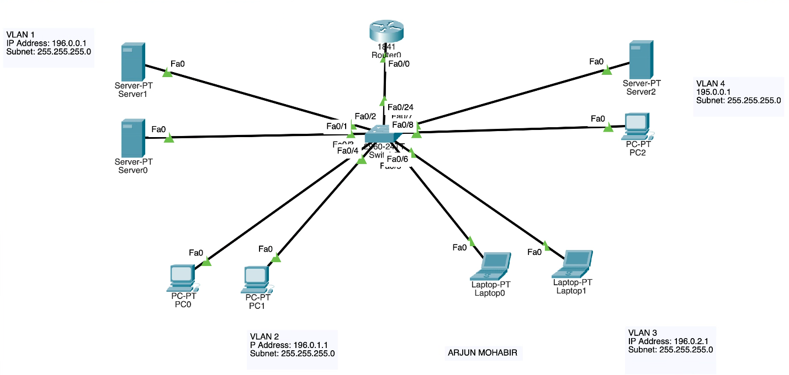

# VLAN Segmentation and Inter-VLAN Routing

## Overview
This project demonstrates VLAN segmentation and inter-VLAN routing in Cisco Packet Tracer using a single switch and a Cisco 1841 router. The network was designed with four VLANs, each assigned to a different subnet and device group. Communication between VLANs was enabled through router-on-a-stick using 802.1Q trunking and router subinterfaces.

## Network Topology
The network is divided into four VLANs:

- **VLAN 1 (Native VLAN)**  
  - 2 Servers  
  - Network: `196.0.0.0/24`  
  - Gateway: `196.0.0.1`

- **VLAN 2**  
  - 2 Desktop PCs  
  - Network: `196.0.1.0/24`  
  - Gateway: `196.0.1.1`

- **VLAN 3**  
  - 2 Laptops  
  - Network: `196.0.2.0/24`  
  - Gateway: `196.0.2.1`

- **VLAN 4**  
  - 1 Server and 1 Desktop  
  - Network: `195.0.0.0/24`  
  - Gateway: `195.0.0.1`

## Technologies and Concepts Used
- Cisco Packet Tracer
- VLAN configuration
- 802.1Q trunking
- Router-on-a-stick
- Inter-VLAN routing
- IPv4 addressing and subnetting

## Configuration Summary
The switch was configured with four VLANs and a trunk link to the router. The router was configured with subinterfaces on FastEthernet0/0, each mapped to a VLAN using 802.1Q encapsulation. End devices were assigned IP addresses within their respective VLAN subnets and configured with the correct default gateways to allow communication across VLANs.

## Skills Demonstrated
- VLAN creation and port assignment
- Trunk configuration between switch and router
- Router subinterface configuration
- Inter-VLAN routing
- Basic network troubleshooting and verification

## Files Included
- `packet-tracer/vlan-inter-vlan-routing.pkt` — Packet Tracer project file
- `images/topology.png` — topology screenshot

## Author
Arjun Mohabir
